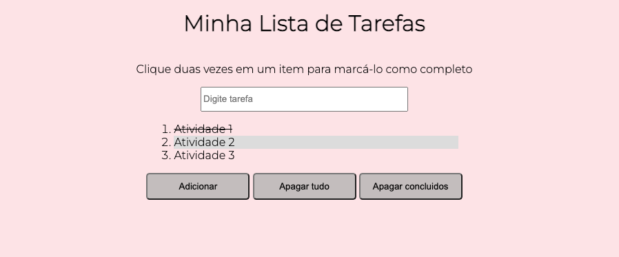

# To Do List
### Projeto realizado durante o módulo de Fundamentos Desenvolvimento Web na Trybe 💚

### Tecnologias utilizadas:

  
  
  

### Sobre o desenvolvimento:
- Individual;

Regras:
* Clicar em um item da lista deve alterar a cor de fundo do item para cinza;

* Clicar duas vezes em um item, faz com que ele seja riscado, indicando que foi completo. Deve ser possível desfazer essa ação clicando novamente duas vezes no item;

[Deploy do projeto]()

